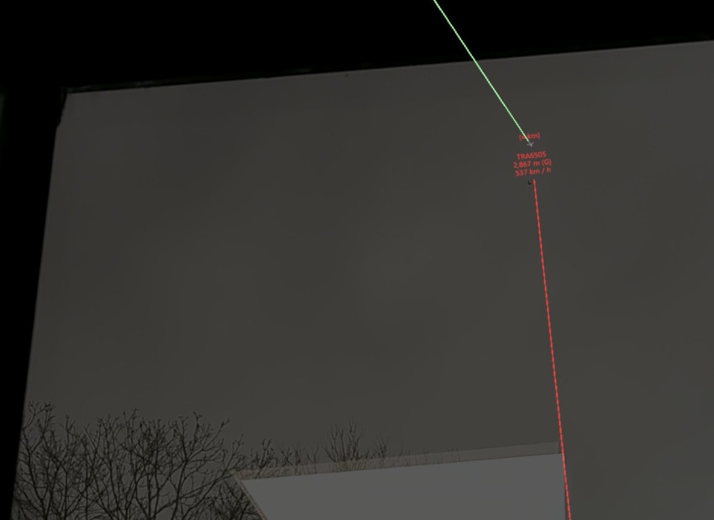

# Dutch SKies - A Mixed Reality view of air traffic over The Netherlands (and elsewhere)

This application provides a real-time view of air traffic in mixed reality, through the
data provided by the [OpenSky Network](opensky-network.org/). It provides both a map view of 
air traffic, *as well as a live view of traffic in the sky* (when properly aligned).

As an example, here's a map view of air traffic around Amsterdam, as seen through mixed reality on
a HoloLens 2:


The flight with callsign TRA6505 has just passed over the observer's location
on the Amsterdam Science Park (marked with the orange pin), and is climbing away. 

Looking out the window TRA6505 is indeed close to the mixed reality projection
of where the plane is expected to be:



Apart from augmenting real air traffic with a mixer reality overlay, the map view
can used to visual inspect air traffic patterns and relations that are otherwise
hard to detect and grasp. For example, here are plane tracks
(in blue) on a windy day. Apparently, quite a few holding patterns where used to
properly guide planes towards Schiphol Airport (which is roughly at the center of the image).


Dutch SKies isn't limited to traffic over The Netherlands. Your own maps and areas
can be configured at will. For example, here is a view of the very busy airspace
surrounding New York:


By having a 3D mixed reality view of air traffic, spatial relations and patterns can
be more intuitively inspected, more so than when looking at the same data on a computer monitor.
The overlay of real-time flight data over the actual flights can help even further.

## Overview

This application was built with the excellent [StereoKit](https://stereokit.net/) framework,
as an entry for the [Mixed Reality Challenge: StereoKit (C# and OpenXR)](https://mixed-reality-stereokit.devpost.com/).

Dutch SKies is Copyright (C) 2021 Paul Melis, SURF (paul.melis@surf.nl). See the section
below for licensing details.

## Requirements

In order to build the application you will need:

* Visual Studio, set up for Windows UWP development, with these two packages installed (through NuGet):
  * [StereoKit](https://stereokit.net/) (developed and tested with 0.3.4)
  * Microsoft.MixedReality.QR
* Python 3, in case you want to run some of the scripts under `Scripts`. Modules used by
  the scripts are
  * [requests](https://pypi.org/project/requests/)
  * [qrcode](https://pypi.org/project/qrcode/) 
  * [PIL(LOW)](https://pypi.org/project/Pillow/)

In order to test Dutch SKies in mixed reality you will need a Microsoft HoloLens 2.


## Disclaimers

Dutch SKies has not been tested outside of Amsterdam, The Netherlands. So with
different geographical locations some bugs will probably surface :) I'm especially 
curious if it works without issues on the Southern Hemisphere when using a custom
map or sky-mode location (see below).

This application has only been tested with a Microsoft HoloLens 2. It might
also work on other devices. Running it in StereoKit desktop mode also works, of course,
but that does not really provide the full experience.

### OpenSky Network real-time data

Note that this application makes use of the [OpenSky Network](https://opensky-network.org/)
as a real-time data provider. As such, when using this application, you are bound to
its [General Terms of Use & Data License Agreement](https://opensky-network.org/about/terms-of-use).


## How to use a custom map

By default, only Amsterdam and Schiphol and Eindhoven airports are included as (hard-coded) maps. The 
Dutch sky is relatively busy with planes, including ones crossing from/to overseas,
others landing at airports nearby the country, etc. So this should provide some interesting 
views out-of-the-box for a country-scale airspace. But you might want to view a different area yourself,
of course.

You will need 3 things to use a custom map/sky view:

1. A JSON configuration file describing the map extent, map image, observer location, etc. You can also
   include a number of landmarks to fine-tune the alignment of the MR world with the real world.

2. An online place to host the JSON configuration file from step 1, and any used map images. 
   This can be anywhere (a Google Drive, your own server, etc), as long as you can provide a URL to the 
   JSON file that is accessible by the HoloLens on on which you plan to run Dutch SKies.

3. A QR code that contains the URL from step 2. You can use `Scripts/text2qrcode.py` to generate
   a PNG image holding the QR code for a given URL. You do not have to print this QR code image, but
   it does need to be visible in sufficient size for the HoloLens to be able to scan it successfully.
   The Microsoft docs suggest at least 5x5 cm, but that seems a bit small. Showing the image full-screen
   on your monitor will allow the HoloLens to scan the QR code, even when it's some distance away.

   Note that StereoKit can take advantage of the QR code's orientation, but this currently isn't used 
   in Dutch SKies.

   By using the QR code only for providing the URL to the actual configuration allows you to update
   that configuration without having to update the QR code.

See the `Example` directory for files corresponding to the examples below.

### Using a map tile service

As an example, let's create a configuration for the San Francisco Bay area, where there are lots of airports.
On [https://www. openstreetmap.org](https://www.openstreetmap.org) we navigate to the San Francisco area,
then use the Export button in the top row. On the left you can see the lat/lon extent for the current view.
You can also choose `Manually select a different area` just below the extent numbers (not visible in the screenshot as it already
has been selected) to more precisely select the extent of our map:


The next step is to create the configuration JSON file. We specify the lat/lon range and other map data involved, plus specify
the server addresses where to fetch tiles (in this case from OpenStreetMap):

```
{
    "query": {
        "lat_range": [
            37.2008,
            37.9193
        ],
        "lon_range": [
            -122.6212,
            -121.6791
        ]
    },

    "maps": [
        {
            "image_source": {
                "type": "osm",
                "tile_servers": [
                    "http://a.tile.openstreetmap.org/{zoom}/{x}/{y}.png",
                    "http://b.tile.openstreetmap.org/{zoom}/{x}/{y}.png",
                    "http://c.tile.openstreetmap.org/{zoom}/{x}/{y}.png"
                ]                
            },
            "lat_range": [
                37.2008,
                37.9193
            ],
            "lon_range": [
                -122.6212,
                -121.6791
            ],
            "name": "sanfrancisco",
            "zoom": 12
        }
    ]
}
```

**Note that there are several different tile servers that can be used as alternatives, see [here](https://wiki.openstreetmap.org/wiki/Tile_servers).
Also note that for the official `openstreetmap.org` servers there is a [Tile Usage Policy](https://operations.osmfoundation.org/policies/tiles/).
Finally, see the relevant FAQ entry below on why these tile server addresses are not hard-coded in the application.**

The `maps` section can list one or more maps, which can be switched in the application. The `query` section determines the area
for which plane data is queried from OpenSky Network. If you leave out the `query` section the query area will be min/max union 
of all map range specified. Note that specifying a very large query area will lead to lots of planes that need to be rendered,
slowing down the framerate, etc. 

Next, we upload this JSON file to a location where the Dutch SKies app can retrieve it. We then generate a QR code for this URL,
display it on a PC screen and use the `Scan QR code` button in the app UI to initiate scanning. As soon as a QR code is recognized 
the scan function is disabled (notified by the button release sound) and the configuration will get loaded. In the process the map 
geometry (initially all grey) and extent are updated, and the process of retrieving the necessary image tiles is started. Once all tiles are retrieved
the map will be updated to show the image.

If everything goes right, you should see this after half a minute:


If anything goes wrong in this workflow then you can check the Log window for warnings/errors.

#### Tile naming scheme

The current implementation is geared towards the tile naming scheme used by OpenStreetMap (x, y, zoom, 256x256 pixels). 


### Using a static map image

Instead of dynamically fetching tiles it is also possible to use static map image. This has
some advantages:

* It is usually faster to load a single image from a source you control, than a bunch of 
  tiles from a service you don't control (or which might change its policies, price, etc)
* You can use custom map imagery, not found in public services
* You can easily add content to the map image in any way you like (e.g. annotations)

As an example, we'll generate a map image and relevant meta-data based for the San Francisco case shown above.
For this, we'll use the `Script/make_osm_map.py` script which retrieves the necessary tiles and pastes them
together in a single image.

We use the extent listed above as arguments to `make_osm_map.py`. The one extra value we need is the 
zoom level, which determines the resolution of the output image. The current value is part of the URL, e.g.
the 10 in `...#map=10/37.4956/...`. At the current zoom level (based on the resolution of the browser window)
the map would be a bit in resolution, so we increase the zoom level a bit. At zoom level 11 the resulting map 
covers 6x6 tiles and is 1536x1536 pixels, at zoom level 12 it covers 12x11 tiles and is 3,072x2816 pixels. 

Here, we use zoom level 12:

```
$ ./make_osm_map.py 37.2008 37.9193 -122.6212 -121.6791 12 sanfrancisco
tile range: i = 652-663, j = 1581-1591
map range:  37.160316546736766 -122.6953125 -> 37.92686760148134 -121.640625
center:  37.54359207410906 -122.16796875
Map size at center = 93.070 x 85.332 km
Retrieving 12 x 11 tiles
(652,1581) (653,1581) (654,1581) (655,1581) ...
Writing output image sanfrancisco.png ... done

$ ls -l sanfrancisco.png
-rw-r--r-- 1 melis users 6808172 Dec  3 21:27 sanfrancisco.png

$ ls -l sanfrancisco.png.json 
-rw-r--r-- 1 melis users 280 Dec  3 21:27 sanfrancisco.png.json

$ cat sanfrancisco.png.json
{
    "image_source": {
        "type": "url",
        "url": "sanfrancisco.png"
    },
    "lat_range": [
        37.160316546736766,
        37.92686760148134
    ],
    "lon_range": [
        -122.6953125,
        -121.640625
    ],
    "name": "sanfrancisco",
    "zoom": 12
}
```

Two files are created, the map image (`sanfrancisco.png`) and a JSON file holding metadata (`sanfrancisco.png.json`).
Note that the actual lat/lon range of the map image is larger than what we specified. This is expected, as only full image tiles are used to cover
the input lat/lon, without clipping the tiles.

The JSON file produced next to the image can be used to set up the necessary configuration JSON file, as shown earlier. Note that if the `url` field does
not start with `http://` or `https://` it is assumed to be a path relative to the URL of the configuration file.

#### Projection

Any map image needs to adhere to the EPSG:3857 projection (also known as [Web Mercator](https://en.wikipedia.org/wiki/Web_Mercator_projection)).
This is the projection used by OpenStreetMap, Google Maps and many others to match [WGS84](https://en.wikipedia.org/wiki/World_Geodetic_System#A_new_World_Geodetic_System:_WGS_84)/EPSG:4326 (basically GPS coordinates) with Web Mercator. 

It is crucial that you that the WGS84 latitude/longitude map extent matches the given map image, other plane locations won't be correct.


## How to use a custom observer location

For getting a correct sky view of the planes you will need to set an observer location. Plus, for fine-tuning
the alignment of the mixed reality view with the real world it can be very useful to specify a number of
landmarks. The latter can be edges of high buildings, chimneys, Church spires, mountain peaks, etc. Preferably something 
that stands out in the environment over which you can easily align a marker line.

You specify the observer id, location and (floor) altitude, and landmark id, location, top and bottom altitude like this:

```
    ...

    "observer": {
        "id": "Office (floor @ desk)",
        "lat": 52.3...,
        "lon": 4.9...,
        "alt": 0.39
    }

    "landmarks": [
        {
            "id": "Tall building left edge",
            "lat": 52.3....,
            "lon": 4.9...,
            "topalt": 68,
            "botalt": -4
        },
        {
            "id": "Tall building right edge",
            "lat": 52.3....,
            "lon": 4.9....,
            "topalt": 68,
            "botalt": -4
        },
        {
            "id": "Low building roof",
            "lat": 52.3..., 
            "lon": 4.9...,
            "topalt": 10.59,
            "botalt": 0.39
        }
    ]

    ...
```

To get the lat/lon values, Google Maps, OpenStreetMaps and other similar services provide a function in their web UIs 
to query the location values for a particular position on the map. A GPS receiver can be another source of values, including
altitude. Note that the altitudes are interpreted to be WGS84 (e.g. GPS) altitudes in meters above sea level. You can estimate
them if you don't have good values and still rely on the position of the vertical lines for trimming the view.

You can either include these extra sections in the JSON configuration file holding the map (as shown earlier), or store
each section (or both) in a separate JSON file. Whenever a QR code is scanned the corresponding JSON file is retrieved and 
any sections in it applied to the current scene.

Whenever landmarks are loaded the button `Landmarks` in the UI will list the number of landmarks. When the button is
enabled each landmark will be drawn as a vertical line with the ID of the landmark. In general, the alignment, especially
with respect to North, will be off substantially. On the main UI window there's a button `Trim observer`, which
opens a window for trimming both horizontal rotation and vertical translation. Use these trimming buttons to get 
the overlay of the landmark lines in the right place. 

Note that the Trim window will stay close to the observer
position currently set (the wind rose on the floor), and will relocate in discrete steps based on head position. The reason
for this is to not have to manually drag the window around while aligning landmarks that surround you, but also not to
tie it directly to the head position and orientation (as the latter makes it harder to use). The current UX choice isn't
perfect, so might get revisited at some point.


## Known issues and bugs

* The device position and orientation at application startup is taken as the mixed reality world origin and axis, 
  with the view direction assumed to be North. The map is placed slightly in front and below of this origin. There currently 
  is no functionality to move the map, other than restarting (this only applies to the map, the sky view can, and usually needs to,
  be trimmed, as described above).

* The JSON parsing isn't very robust currently, either to syntax errors in the JSON data itself,
  nor to fields/values that are expected, but missing.

* The map surface always represents an altitude of 0m (sea level), which will look weird for planes landing at airports
  at much higher altitudes. Having a real 3D map with terrain height would fix that, although the actual
  visible height above the map is fairly small compared to the map dimensions on most cases (see also FAQ below).

* When loading a configuration that uses a large map image, the rendering can briefly be interrupted
  (even with the view going fully black), while the map is processed and uploaded to the GPU. At the moment,
  there is no easy fix for this.


## FAQ

* **Can it be built for VR, e.g. Oculus Quest?**

  In principle yes, as the code is based mostly on StereoKit, which also supports any OpenXR device, including
  for VR. But the current project file and solution are tied to UWP as platform. Also, at least the QR code scanning will 
  currently not work on a Quest (and possibly other things as well).

* **The planes seem to be jump a bit every few seconds**

  The updated plane location data from the OpenSky Network is only retrieved every few seconds. 
  The movement of the virtual planes is currently extrapolated based on the last received data, 
  so might be a little bit off until the next set of data points is retrieved.

  An alternative could be to retrieve the last *two* known data points for each plane and then interpolate
  the plane path between those, but that would mean plane locations would lag by about 5-10 seconds,
  which would then not match very well with the actual physical location of the planes.
  
  Also see the next question.

* **The sky-mode virtual planes are not aligned very well with real-world planes!**

  Yes, this is expected and almost unavoidable, although the virtual overlay
  can be tweaked to be fairly close to the real planes. It certainly should be accurate enough
  to track and identify real planes without too much ambiguity.
  
  There are (at least) three reasons for the mismatch:
  
  1. The real-time plane tracking data provided by the OpenSky Network is pretty
     accurate when it comes to a plane's position, but the timestamp attached
     to that data point only has a granularity of one second (the `time_position`
     field in the [REST API](https://openskynetwork.github.io/opensky-api/rest.html)).
     In that one second a fast-flying plane will move quite a bit across the sky. 
     So even though the position is given with precision, the exact moment of *when* 
     the plane was at that position is not known accurately enough. 
     
  2. As the data from the OpenSky Network only provides a plane's location at some
     moment in the past, a prediction needs to be made where the plane is *right now*, in order
     to overlay the virtual plane. This prediction isn't currently very good, especially
     for planes that are changing course and speed a lot (e.g. when making a turn to line
     up with the runway). The prediction can probably be improved, e.g. using
     Kalman filtering.
     
  3. Alignment of the Mixed Reality world with the physical world is imprecise. The HoloLens 2
     does not have location sensors, although Wifi-based location tracking might be
     of some use. The manual specification of the current location (using a QR code
     specifying lat/lon/altitude) can be pretty accurate, and any small deviations 
     from the ground truth in position will not lead to much misalignment. 
     
     But setting the *orientation* of the virtual world with any precision is a bit 
     tricky, and any rotation away from true North will be quite noticeable, as the 
     virtual planes will be either behind or in front of their real planes. Hence, the
     option to do orientation (and height) trimming through the UI. 

* **How about including terrain height in the map?**

  For the case of The Netherlands this doesn't have much value ;-). The highest
  "mountain" in The Netherlands is 321m high (the Vaalserberg). The lowest point
  is around 6.74m *below* sea level. The default map is around 360km wide, shown
  at 1.5m physical size in the MR world. That translates to 240m of altitude
  per *millimeter* of physical (MR) map size. So the height difference for The 
  Netherlands would amount to less than 2 millimeters in MR, not really worth it.
  
  For a different area in the world, or when using a much smaller map of mountainous
  terrain, it might make more sense to include height, though.

* **Why not use a (3D) terrain service, such as Bing Maps?**

  Indeed, there is the Stereo Kit [Bing Maps sample](https://github.com/maluoi/StereoKit-BingMaps),
  although I did not try it, nor looked at the code. The reason is that it
  requires a Bing Maps API key, plus it would base this code on non-free (and commercial)
  software. The same would hold for other similar services.
  
  The current setup, based on pre-generated maps, is simple and free to 
  use and customize. It does not need registration, nor an API key. Adding your
  own maps is fairly easy, see the section above.

* **Why not simply hard-code OpenStreetMap tile downloading in the code? Why the indirection
  using `tile_servers` in the JSON configuration files?**

  Hard-coding the URLs of OSM tile servers in the code is against the OSM [Tile Usage Policy](https://operations.osmfoundation.org/policies/tiles/),
  or at least, it's strongly discouraged. And using the JSON file to specify tile
  servers allows future extensions to use other tile schemes and servers, or to 
  use a [local OSM cache](https://github.com/paulmelis/osmcache) (the latter allows much
  faster tile retrieval during development cycles).
  

## License

All files, except those listed under the Attributions subsection, are licensed
under a Creative Commons [CC BY-NC-SA 4.0](https://creativecommons.org/licenses/by-nc-sa/4.0/)
license, which is summarized below. See LICENSE.txt for the full licensing terms. 

You are free to:

* Share - copy and redistribute the material in any medium or format

* Adapt - remix, transform, and build upon the material 

Under the following terms:

* Attribution - You must give appropriate credit, provide a link to the license, and 
  indicate if changes were made. You may do so in any reasonable manner, but not in 
  any way that suggests the licensor endorses you or your use. 

* NonCommercial - You may not use the material for commercial purposes. 

* ShareAlike - If you remix, transform, or build upon the material, you must 
  distribute your contributions under the same license as the original. 
  
* No additional restrictions - You may not apply legal terms or technological measures that legally restrict others from doing anything the license permits. 

### Attribution

* The map files under `Assets/Maps` and under `Example` are generated from [OpenStreetMap](www.openstreetmap.org) tiles,
  using the `Scripts/make_osm_map.py` script. The tiles, and the derived map images, have credit "(C) OpenStreetMap contributors"
  and are distributed under the [Open Data Commons Open Database License (ODbL)](https://opendatacommons.org/licenses/odbl/).
  See [here](https://www.openstreetmap.org/copyright) for more info.

* SimpleJSON.cs is from the [SimpleJSON](https://github.com/Bunny83/SimpleJSON) repository.
  See SimpleJSON-LICENSE.txt for the original license.
  
* The airplane 3D model is based on a model file retrieved from Google Poly (while it was still active) 
  under the name "Airplane", originally licensed under a [CC-BY 3.0](https://creativecommons.org/licenses/by/3.0/) 
  license. The included model is an edited version of the retrieved model. 

* Compass rose adapted from https://commons.wikimedia.org/wiki/File:Windrose.svg,
  original (Windrose.original.svg) and redistributed file (Windrose.svg) licensed 
  under [Creative Commons Attribution-Share Alike 3.0 Unported](https://creativecommons.org/licenses/by-sa/3.0/deed.en).
  
* The logo (`Assets/Logo.svg`) uses `Assets/Airplane_silhouette.svg` (from https://en.m.wikipedia.org/wiki/File:Airplane_silhouette.svg, 
  which is placed in the public domain). It also uses `Assets/Blank_map_of_the_Netherlands.svg` (from https://nl.wikipedia.org/wiki/Bestand:Blank_map_of_the_Netherlands.svg, which is shared under [Attribution-ShareAlike 3.0 Unported (CC BY-SA 3.0)](https://creativecommons.org/licenses/by-sa/3.0/deed)).
   
* Some files are from the StereoKit sources (`Assets/floor.hlsl`).
  